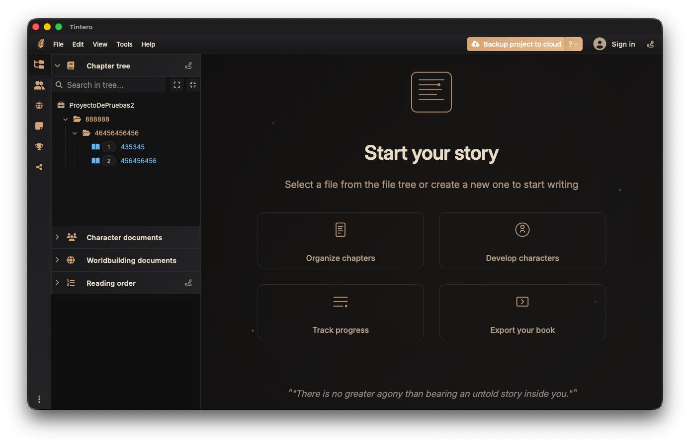

# Tintero Theme Template

This is a complete template for creating custom themes for [Tintero](https://tintero.com), the creative writing application.



## 📦 What's Included

- `theme.css` - Complete CSS file with all available variables and examples
- `theme.json` - Theme metadata (name, author, version, etc.)
- `preview.png` - Preview image for the theme browser
- `README.md` - This documentation

## 🎨 Creating Your Own Theme

### Step 1: Clone or Fork This Repository

```bash
git clone https://github.com/yourusername/tintero-theme-template
cd tintero-theme-template
```

### Step 2: Customize theme.json

Edit `theme.json` with your theme information:

```json
{
  "name": "My Awesome Theme",
  "id": "my-awesome-theme",
  "version": "1.0.0",
  "author": "Your Name",
  "description": "A description of your theme",
  "repository": "https://github.com/yourusername/tintero-theme-awesome",
  "preview": "preview.png",
  "license": "MIT",
  "tags": ["dark", "minimal", "warm"],
  "colors": {
    "primary": "#c98a48",
    "background": "#121212",
    "text": "#e6d7c2"
  }
}
```

### Step 3: Edit theme.css

Customize the CSS variables in `theme.css`. The file is organized into sections:

#### Font Variables
```css
--interface-font: 'Inter Variable', sans-serif;
--tab-font: 'Inter Variable', sans-serif;
--editor-font: 'EB Garamond', serif;
--font-help: 'Source Sans Variable', sans-serif;
```

#### Base Colors
```css
--dark-bg: #121212;
--dark-secondary: #181818;
--text-primary: #e6d7c2;
--accent-color: #c98a48;
```

#### Custom CSS Rules

You can also add custom CSS rules at the bottom of the file:

```css
/* Increase font size globally */
html,
html *:not(i) {
  font-size: 101.5% !important;
}

/* Custom scrollbar */
::-webkit-scrollbar {
  width: 8px;
}

::-webkit-scrollbar-thumb {
  background: var(--accent-color);
  border-radius: 4px;
}
```

### Step 4: Create a Preview Image

Replace `preview.png` with a screenshot of your theme in action. Recommended size: **800x600px**.

You can use:
- A screenshot of Tintero with your theme applied
- A mockup showing the color palette
- Any image that represents your theme

### Step 5: Test Your Theme

1. Open Tintero
2. Go to **Settings** → **Style** → **Local Themes**
3. Click **Upload Theme**
4. Select your `theme.css` file
5. Apply and test your theme

## 📚 Available CSS Variables

### Colors

| Variable | Description | Example |
|----------|-------------|---------|
| `--dark-bg` | Main background | `#121212` |
| `--dark-secondary` | Secondary background | `#181818` |
| `--dark-tertiary` | Tertiary background | `#222222` |
| `--text-primary` | Primary text color | `#e6d7c2` |
| `--text-secondary` | Secondary text color | `#a98e6b` |
| `--accent-color` | Accent/highlight color | `#c98a48` |
| `--accent-color-hover` | Accent hover state | `#e1a66b` |
| `--border-color` | Border color | `#2d2d2d` |

### Fonts

| Variable | Description | Example |
|----------|-------------|---------|
| `--interface-font` | UI elements font | `'Inter Variable', sans-serif` |
| `--editor-font` | Editor font | `'EB Garamond', serif` |
| `--tab-font` | Tab font | `'Inter Variable', sans-serif` |
| `--base-font-size` | Base font size | `14px` |

### Advanced

| Variable | Description |
|----------|-------------|
| `--sidebar-background` | Sidebar gradient |
| `--menu-bar-background` | Menu bar gradient |
| `--button-primary-background` | Primary button style |
| `--editor-zoom` | Editor zoom level |

See `theme.css` for the complete list of variables with descriptions.

## 🎯 Color Conversion

Tintero automatically generates complementary color formats:

- **Hex colors** → Automatically creates `-rgba` version
  - `--dark-bg: #121212` → generates `--dark-bg-rgba: rgba(18, 18, 18, 1)`

- **RGBA colors** → Automatically creates hex version
  - `--overlay-rgba: rgba(0, 0, 0, 0.5)` → generates `--overlay: #000000`

You don't need to define both formats manually!

## 📤 Publishing Your Theme

### Option 1: GitHub Repository (Recommended)

1. Create a new GitHub repository for your theme
2. Push your theme files
3. Create a release with version tag (e.g., `v1.0.0`)
4. Share the repository URL

### Option 2: Direct Distribution

Users can download your `theme.css` file and install it as a local theme in Tintero.

## 🌟 Theme Examples

### Cyberpunk Theme
```css
:root {
  --dark-bg: #0a0e27;
  --accent-color: #00ff9f;
  --text-primary: #e0e0e0;
}
```

### Light Theme
```css
:root {
  --dark-bg: #ffffff;
  --dark-secondary: #f5f5f5;
  --text-primary: #2c3e50;
  --accent-color: #3498db;
}
```

### Sepia Theme
```css
:root {
  --dark-bg: #f4ecd8;
  --text-primary: #5c4a3a;
  --accent-color: #8b6f47;
}
```

## 📝 Best Practices

1. **Test on both light and dark environments** - Ensure your theme works well in different lighting conditions
2. **Maintain good contrast** - Ensure text is readable (WCAG AA minimum)
3. **Use semantic naming** - If you create custom variables, use descriptive names
4. **Document your changes** - Add comments explaining non-obvious choices
5. **Version your theme** - Use semantic versioning (MAJOR.MINOR.PATCH)

## 🐛 Troubleshooting

### Theme doesn't apply

- Make sure the CSS is valid (no syntax errors)
- Check that variables are defined within `:root { }`
- Clear cache and reload Tintero

### Colors look wrong

- Verify hex color format is correct (`#RRGGBB`)
- Check that RGBA values are within valid ranges (0-255 for RGB, 0-1 for alpha)
- Ensure you're not using `var()` with undefined variables

### Custom CSS rules not working

- Use `!important` sparingly and only when necessary
- Check browser console for CSS errors
- Verify selectors are correct

## 📖 Resources

- [Tintero Official Website](https://tintero.app)
- [CSS Variables Guide](https://developer.mozilla.org/en-US/docs/Web/CSS/Using_CSS_custom_properties)
- [Color Palette Generators](https://coolors.co)
- [Web Font Resources](https://fonts.google.com)

## 🤝 Contributing

Found a missing variable or want to improve this template?

1. Fork this repository
2. Make your changes
3. Submit a pull request

## 📄 License

This template is released under the MIT License. Your themes can use any license you prefer.

---

**Happy Theming! 🎨**

Made with ❤️ for the Tintero community
